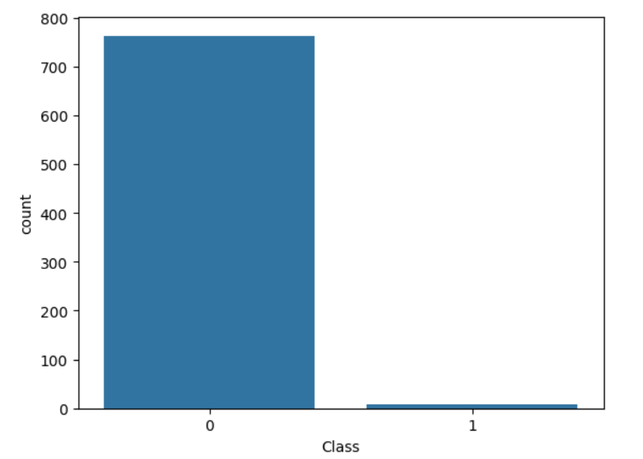
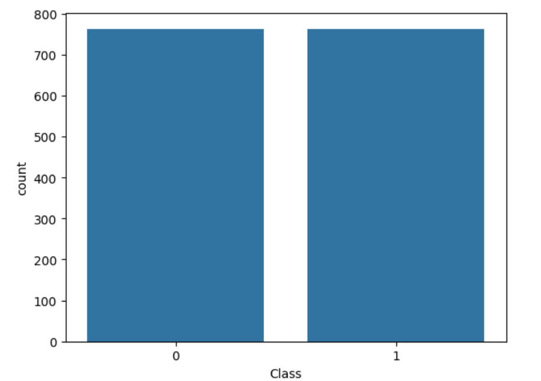
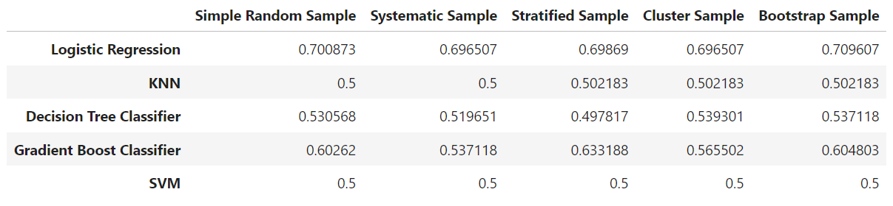

# Sampling
Applying five different sampling techniques to five different ML models (Logistic Regression, KNN, Decision Tree, Gradient Boost, SVM)

## **1. Methodology**
1. Convert dataset into balanced class dataset.
2. Create samples using five different methods.
3. Apply the different samples on five different ML models.
4. Compare the results obtained.

## **2. Input / Output**

Unbalanced Dataset

Balanced Dataset

## **3. ML Models Used**
1. Logistic Regression
2. K Nearest Neighbours
3. Decision Tree
4. Gradient Boost
5. SVM

## **4. Sampling Techniques Used**
1. Simple Random Sampling
2. Systematic Sampling
3. Stratified Sampling
4. Cluster Sampling
5. Bootstrap Sampling

## **5. Result**
Logistic regression achieved the highest accuracy with Bootstrap sampling having the highest accuracy of 0.709607.

